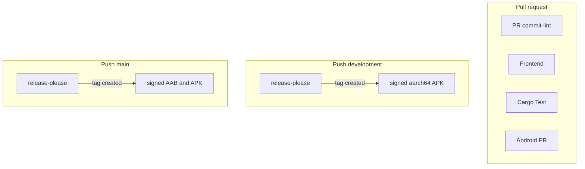

# CI/CD Documentation

GitHub Actions pipelines for KA CityRail Navigator (Tauri v2 + React + Android).

## Workflow map

| Workflow | File | Trigger | What it does |
|----------|------|---------|--------------|
| **PR** | `workflows/pr.yml` | PR → `development` / `main` | Conventional Commits title lint |
| **Frontend** | `workflows/frontend.yml` | PR (path-filtered) | `npm test` + `npm run build` |
| **Cargo Test** | `workflows/cargo-test.yml` | Push + PR (path-filtered) | `cargo fmt` + `clippy -D warnings` + `cargo test` |
| **Android PR** | `workflows/android-pr.yml` | PR (path-filtered) or `workflow_dispatch` | Unsigned aarch64 APK smoke build |
| **Development** | `workflows/development.yml` | Push → `development` | release-please + signed arm64 APK on new tag |
| **Release** | `workflows/release.yml` | Push → `main` | release-please + signed AAB/APK + optional Play Store |
| **Security Scans** | `workflows/security.yml` | PR, push, weekly cron | CodeQL + npm/cargo audit |

## Path filters (what skips what)

| Change set | Frontend | Cargo Test | Android PR |
|------------|----------|------------|------------|
| `src/**` only (no Rust) | runs | skip | skip |
| `src-tauri/**` | skip* | runs | runs |
| `scripts/patch-android-manifest.sh` | skip | skip | runs |
| Docs / LICENSE only | skip | skip | skip |

\* Frontend still runs if the PR also touches FE paths (`package.json`, `vite.config.ts`, etc.).

**Force Android PR** without touching those paths: Actions → **Android PR** → **Run workflow**.

## Composite actions

Lean setup pieces under `.github/actions/` (no mega `setup-environment`):

| Action | Role |
|--------|------|
| `setup-node-npm` | Node 20 + `npm ci` |
| `setup-rust` | Toolchain, optional GTK, cargo cache (`cache-key-prefix` separates desktop vs android) |
| `setup-android` | Java 17 + SDK + NDK |
| `android-build` | `tauri android init` → manifest patch → optional signing → APK/AAB |
| `configure-android-signing` | Keystore + Gradle release signing |

## Required checks (branch protection)

Suggested settings for `development` / `main`:

- Safe to require: **PR / commit-lint** — `pr.yml` has no path filter, so it always reports. On `release-please--*` branches the job is skipped by its `if:`, and GitHub counts a skipped job as passing.
- Do **not** require: **Frontend / frontend**, **Cargo Test / rust**, **Android PR / apk**.

Those three come from path-filtered workflows. When the filter does not match, GitHub creates no check run at all — and a required check that never reports stays pending forever. A docs-only PR would block on all three; a Rust-only PR would block on Frontend. GitHub has no “required if present” setting, so the filters and the required list have to agree.

## Secrets and variables

**Secrets** (Settings → Secrets and variables → Actions):

| Secret | Used by |
|--------|---------|
| `ANDROID_KEYSTORE_BASE64` | Development, Release |
| `ANDROID_KEY_ALIAS` | Development, Release |
| `ANDROID_KEY_PASSWORD` | Development, Release |
| `PLAY_STORE_SERVICE_ACCOUNT_JSON` | Release → Play Store job |

**Variables:**

| Variable | Value | Effect |
|----------|-------|--------|
| `AUTO_PUBLISH_PLAYSTORE` | `true` | Upload AAB to Play internal track on main release |

Versioning is owned by **release-please** (`release-please-config.json` / `release-please-config-dev.json`), not branch-name heuristics.

## Troubleshooting

### Android PR did not run
Path filter skipped it. Touch `src-tauri/` or use **workflow_dispatch** on Android PR.

### Frontend did not run
Only docs changed, or no FE paths in the PR. Touch `src/` or `package.json` to trigger.

### Signed build fails on keystore
Check `ANDROID_KEYSTORE_BASE64` encoding and alias/password secrets in the `Vars` environment.

### Cargo Test vs Android caches
Desktop tests use `cargo-test-*` cache keys; Android builds use `cargo-android-*` so they do not thrash each other.
