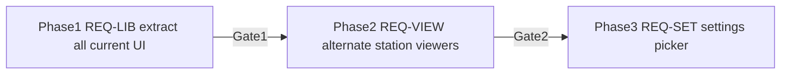

# Requirements: app component library

This plan **is** the requirements document. Every change must map to an ID below (`REQ-LIB-*`, `REQ-PAGE-*`, `REQ-VIEW-*`, `REQ-SET-*`, `REQ-T-*`, `REQ-OUT-*`). Gate fails if any required ID for that phase is unmet.



Branch: `feat/app-component-lib` from `development` (or CI-redesign tip once merged).

Keep this file at [`docs/REQUIREMENTS-app-component-lib.md`](docs/REQUIREMENTS-app-component-lib.md).

---

## 0. Goal

**Primary (this plan’s real job):** turn every presentational chunk of the current frontend into a reusable **app component library** under `src/components/`. `App.tsx` / page files keep state, effects, Tauri invokes — not markup soup.

**Secondary (later phases):** once station departure body is a component with a stable props contract, add more viewer kinds and a Settings switch.

Today already in `src/components/`: `BottomNav`, `LineBadge`, `ProximityMap`, `RouteMap`, `Icons`. Everything else still lives inline in `App.tsx`, `Settings.tsx`, `DepartureDetails.tsx`.

---

## 0.1 Scope matrix

### In scope

| Area | Extract from | Target | Phase |
|------|--------------|--------|-------|
| Loading screen | `App.tsx` | `LoadingScreen` | 1 |
| App header (logo + connection + refresh) | `App.tsx` | `AppHeader` | 1 |
| Search bar | `App.tsx` | `SearchBar` | 1 |
| Error / manual-location banners | `App.tsx` | `ErrorBanner`, `ManualModeBanner` | 1 |
| Station card shell | `App.tsx` | `StationCard` | 1 |
| Departures table (current viewer) | `App.tsx` | `StationDeparturesTable` | 1 |
| `groupByPlatform` | `App.tsx` | `station/groupByPlatform.ts` | 1 |
| Network status card | `App.tsx` | `NetworkStatusCard` | 1 |
| Map card chrome around `ProximityMap` | `App.tsx` | `ProximityMapCard` | 1 |
| Departures page layout shell | `App.tsx` | `DeparturesPage` (optional compose) | 1 |
| Settings page sections as components | `Settings.tsx` | `settings/*` | 1 |
| Departure details sections | `DepartureDetails.tsx` | `details/*` (incl. move `RouteTimeline`) | 1 |
| Public barrel | — | `src/components/index.ts` exports lib | 1 |
| Alternate station viewers | — | `compact`, `board` | 2 |
| Settings: viewer kind | `storage` + Settings | `stationViewerKind` | 3 |

### Out of scope (`REQ-OUT`)

| ID | Not done |
|----|----------|
| REQ-OUT-1 | No Tauri / Rust / KVV API changes |
| REQ-OUT-2 | No new visual redesign / theme tokens / dark mode |
| REQ-OUT-3 | No behavior change vs current UI in Phase 1 (parity extract only) |
| REQ-OUT-4 | No E2E / Playwright |
| REQ-OUT-5 | No npm package publish; lib is in-repo only (`src/components`) |
| REQ-OUT-6 | No per-station viewer override |
| REQ-OUT-7 | No rewriting utils (`geo`/`time`/`async`) — import them from components as today |

---

## Library layout (target)

```
src/components/
  index.ts                 # public app component lib barrel
  Icons.tsx                # exists
  LineBadge.tsx            # exists
  BottomNav.tsx            # exists
  ProximityMap.tsx         # exists
  RouteMap.tsx             # exists
  layout/
    LoadingScreen.tsx
    AppHeader.tsx
    SearchBar.tsx
    ErrorBanner.tsx
    ManualModeBanner.tsx
  station/
    groupByPlatform.ts
    StationCard.tsx
    StationDeparturesTable.tsx   # current table = default viewer
    NetworkStatusCard.tsx
    ProximityMapCard.tsx
  settings/                      # presentational pieces Settings composes
    …section components as needed
  details/
    RouteTimeline.tsx
    DepartureDetailsHeader.tsx   # or keep one DepartureDetails that composes lib pieces
    …
```

Exact file splits may vary; **every user-visible block listed in Phase 1 must live under `src/components/`** and be imported by pages. Pages may stay at `src/App.tsx`, `src/Settings.tsx`, `src/DepartureDetails.tsx` as thin containers, or move under `src/pages/` — optional, not required.

CSS: colocated next to component (preferred) or one folder CSS. `App.css` / `Settings.css` / `DepartureDetails.css` shrink to layout leftovers only — no duplicate rules for moved classes.

---

## Phase 1 — Extract all current UI into the lib (`REQ-LIB`)

**Rule:** pixel + behavior parity. No new Settings fields. No alternate viewers.

### REQ-LIB-1 — Departures surface components

| ID | Component | Must accept / do |
|----|-----------|------------------|
| REQ-LIB-1a | `LoadingScreen` | logo + spinner + loading text (current copy OK) |
| REQ-LIB-1b | `AppHeader` | logo, connection indicator (wifi/ethernet/offline + label), refresh button + `refreshing` |
| REQ-LIB-1c | `SearchBar` | controlled `value` / `onChange`; search + filter affordances as today |
| REQ-LIB-1d | `ErrorBanner` | message string |
| REQ-LIB-1e | `ManualModeBanner` | `onChangeLocation` callback |
| REQ-LIB-1f | `StationCard` | stop id/name, starred, network pin optional, distance, collapsed, children = body; star/pin/collapse handlers |
| REQ-LIB-1g | `StationDeparturesTable` | `departures`, `stopId`, `routeLoadingId`, `onDepartureClick`; empty state; platform groups; LineBadge; ETA/delay/loading `…` |
| REQ-LIB-1h | `NetworkStatusCard` | label, ssid, pinned count |
| REQ-LIB-1i | `ProximityMapCard` | title/count chrome + wraps existing `ProximityMap` props |

### REQ-LIB-2 — Move `groupByPlatform`

Pure fn → `src/components/station/groupByPlatform.ts` (or `src/utils/` if preferred — but station lib must use one shared copy). App must not keep a private duplicate.

### REQ-LIB-3 — Settings surface components

Split [`Settings.tsx`](src/Settings.tsx) presentational sections into `src/components/settings/` (names flexible), e.g.:

- display settings form (nearby limit, time window, save)
- manual coords form
- starred stops list / search-add
- networks list / add / remove / detect current

Container `Settings.tsx` keeps invoke + state; components take props/callbacks only.

### REQ-LIB-4 — Details surface components

Move `RouteTimeline` and other details cards/header pieces from [`DepartureDetails.tsx`](src/DepartureDetails.tsx) into `src/components/details/`. Page file composes them. Keep `RouteMap` import via lib barrel.

### REQ-LIB-5 — Barrel

`src/components/index.ts` is the **app component lib** entry: export all public components + types needed by pages. Pages import from `./components` (or `./components/…` for deep settings/details if cleaner — document choice in PR).

### REQ-LIB-6 — App / pages are containers

After Phase 1, `App.tsx` departure JSX is mostly composition:

```tsx
<LoadingScreen /> | <AppHeader /> + <SearchBar /> + banners +
  displayStops.map → <StationCard><StationDeparturesTable /></StationCard> +
  <NetworkStatusCard /> + <ProximityMapCard /> + <BottomNav />
```

No departure-row / station-header markup left inline in App.

### REQ-T-LIB — Tests

| ID | Assert |
|----|--------|
| REQ-T-LIB1 | `groupByPlatform`: empty; single platform; blank platform bucket; numeric sort (`2` before `10`) |
| REQ-T-LIB2 | barrel exports exist for every REQ-LIB-1 component (smoke import test or type-level check OK) |

### Gate 1

- [ ] REQ-LIB-1a..i, REQ-LIB-2..6 done
- [ ] REQ-T-LIB1 green
- [ ] Manual parity: load, search, collapse, star, network pin, departure → details, map scroll to `#station-*`, settings sections, details timeline
- [ ] `npm test` + `npm run build` green
- [ ] REQ-OUT-3 held (no intentional UX change)

**Stop.** No alternate layouts until Gate 1.

---

## Phase 2 — Multiple station viewers (`REQ-VIEW`)

Only after Gate 1. Body behind `StationCard` becomes swappable.

### Kind id

```ts
type StationViewerKind = "table" | "compact" | "board";
```

| Kind | Meaning |
|------|---------|
| `table` | Current `StationDeparturesTable` (default) |
| `compact` | Dense row: badge + destination; time/ETA secondary |
| `board` | Time/ETA emphasized; badge + destination visible |

### REQ-VIEW-1 — Shared props

```ts
type StationViewerProps = {
  stopId: string;
  departures: Departure[];
  routeLoadingId: string | null;
  onDepartureClick: (dep: Departure) => void;
};
```

All kinds: empty copy, click, loading `…`, delay `+N min`, platform grouping for `table`/`compact` (board: group or show platform per row).

### REQ-VIEW-2 — Registry + fallback

`getStationViewer(kind)` → component; unknown → `table`.

### REQ-VIEW-3 — Implement `compact` + `board`

Parity of interactions with table.

### REQ-VIEW-4 — Temp switch

Until Phase 3: `const ACTIVE_VIEWER: StationViewerKind = "table"` in App for QA.

### REQ-T-VIEW

| ID | Assert |
|----|--------|
| REQ-T-VIEW1 | registry returns component for all three kinds |
| REQ-T-VIEW2 | unknown → table |

### Gate 2

- [ ] REQ-VIEW-1..4 + tests green
- [ ] Manual flip all three kinds
- [ ] `npm test` + `npm run build` green

**Stop.** No Settings persistence until Gate 2.

---

## Phase 3 — Settings wiring (`REQ-SET`)

### REQ-SET-1 — `DisplaySettings.stationViewerKind` default `"table"`

Load merge + unknown → `"table"`. Save round-trip. Backward compatible with old localStorage JSON.

### REQ-SET-2 — Settings UI control (Table / Compact / Board)

Uses existing display-save pattern.

### REQ-SET-3 — App reads setting; remove Phase-2 const

Display-only: kind change must not refetch.

### REQ-T-SET

Defaults, compact load, weird → table, save/load round-trip.

### Gate 3

- [ ] REQ-SET-* + tests green
- [ ] Manual persist across reload
- [ ] REQ-OUT-* respected
- [ ] `npm test` + `npm run build` green

---

## Traceability

| Want | IDs |
|------|-----|
| Full app component lib from current UI | REQ-LIB-* |
| Alternate station line/time layouts | REQ-VIEW-* |
| User picks layout in Settings | REQ-SET-* |
| Non-goals | REQ-OUT-* |
| Tests | REQ-T-* |

---

## Local verify

```bash
npm test
npm run build
# Manual: full departures / settings / details click-through after Phase 1
```

---

## Execute order

1. `groupByPlatform` + test → station + layout extracts from App → Gate 1 settings/details extracts → barrel  
2. compact + board + registry → Gate 2  
3. storage + Settings picker → Gate 3  
