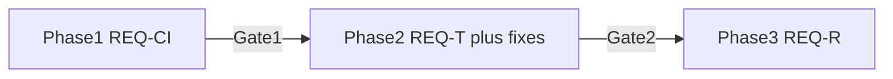

# Requirements: cleanup, tests, CI

This plan **is** the requirements document. Every change must map to an ID below (`REQ-CI-*`, `REQ-T-*`, `REQ-R-*`, `REQ-OUT-*`). Gate fails if any required ID for that phase is unmet.



Branch: `refactor/testable-structure` from `development`.

On execute, also write this same requirements body into repo as [`docs/REQUIREMENTS-testable-structure.md`](docs/REQUIREMENTS-testable-structure.md) so reviewers see it outside Cursor.

---

## 0. Scope matrix

### In scope (will change or gain tests)

| Area | Files | Phase |
|------|-------|-------|
| CI Rust pipeline | `.github/workflows/cargo-test.yml` only (fmt/clippy/test on push+PR); not duplicated in PR Validation | 1 |
| Pure Rust helpers | [`src-tauri/src/helpers.rs`](src-tauri/src/helpers.rs) | 2 test / 3 untouched unless bugfix |
| SQLite repo | [`src-tauri/src/db.rs`](src-tauri/src/db.rs) | 2 test / 3 untouched unless bugfix |
| KVV JSON→domain | logic today inside [`src-tauri/src/kvv.rs`](src-tauri/src/kvv.rs) → new `kvv_parse.rs` | 3 |
| FE pure helpers | today private in [`src/App.tsx`](src/App.tsx) → `src/utils/*` | 3 |
| FE types | `Departure` / trip types in App → [`src/types.ts`](src/types.ts) | 3 |
| FE test runner | `package.json`, `vite.config.ts`, `*.test.ts` | 3 |
| FE CI | `npm test` step in `pr-validation.yml` | 3 |

### Out of scope (`REQ-OUT`)

| ID | Not done in this work |
|----|------------------------|
| REQ-OUT-1 | No change to Tauri command names / signatures in `lib.rs` invoke list |
| REQ-OUT-2 | No `network.rs` / `nmcli` / Android wifi unit tests (platform-coupled) |
| REQ-OUT-3 | No live HTTP calls to KVV in CI |
| REQ-OUT-4 | No E2E / Playwright / full App mount tests |
| REQ-OUT-5 | No CSS / Settings UI redesign |
| REQ-OUT-6 | No coverage % gates |
| REQ-OUT-7 | No `dev-build.yml` / release APK pipeline changes (except they stay green) |

---

## Phase 1 — CI requirements (`REQ-CI`)

### REQ-CI-1 — Workflow on commit

Create [`.github/workflows/cargo-test.yml`](.github/workflows/cargo-test.yml):

- **Triggers:** `push` and `pull_request` to `development` and `main`
- **Path filter:** `src-tauri/**`, `.github/workflows/cargo-test.yml`
- **Must not** build Android APK (fast pipeline)

### REQ-CI-2 — Exact steps (fail job on any fail)

| Step | Command |
|------|---------|
| fmt | `cargo fmt --manifest-path src-tauri/Cargo.toml --all -- --check` |
| clippy | `cargo clippy --manifest-path src-tauri/Cargo.toml --all-targets --all-features -- -D warnings` |
| test | `cargo test --manifest-path src-tauri/Cargo.toml --all-features` |

### REQ-CI-3 — No duplicate Rust gate in PR Validation

[`pr-validation.yml`](.github/workflows/pr-validation.yml) does **not** re-run fmt/clippy/`cargo test`. It owns FE (`npm test` / build) + Android APK. Rust quality is owned by `cargo-test.yml` only.

### Gate 1

- [x] REQ-CI-1, REQ-CI-2, REQ-CI-3 done
- [x] One successful workflow run on the branch (empty test suite allowed)

**Stop.** No product tests or refactors until Gate 1.

---

## Phase 2 — Test current code + fix (`REQ-T`, `REQ-FIX`)

**Rule:** tests describe **today’s** public/pure behavior. Move no files. Split no modules. Only edit production code to fix proven bugs/lints.

### How tests run

```bash
cargo fmt --manifest-path src-tauri/Cargo.toml --all -- --check
cargo clippy --manifest-path src-tauri/Cargo.toml --all-targets --all-features -- -D warnings
cargo test --manifest-path src-tauri/Cargo.toml --all-features
```

Location: `#[cfg(test)] mod tests` inside the same `.rs` file (helpers, db). Dev-dep: `tempfile` for DB only.

---

### REQ-T-H — `helpers.rs` (exact cases)

| ID | Function | Input | Expected |
|----|----------|-------|----------|
| REQ-T-H1 | `shorten_line_number` | `"ICE 372 InterCityExpress"` | `"ICE 372"` |
| REQ-T-H2 | `shorten_line_number` | `"S1"` (no known prefix+digits pattern beyond list) | `"S1"` unchanged (or current real behavior — lock what code does today) |
| REQ-T-H3 | `shorten_line_number` | `"IC 123 Foo"` | `"IC 123"` |
| REQ-T-H4 | `trip_code_from_realtime_trip_id` | id containing `T0.1385` then non-digit | `Some("1385")` |
| REQ-T-H5 | `trip_code_from_realtime_trip_id` | no `T0.` | `None` |
| REQ-T-H6 | `parse_time_field` | hour `"9"`, minute `"5"` | `"09:05"` |
| REQ-T-H7 | `json_to_i64` | JSON string `"12"` / number `12` / junk | `12` / `12` / `0` |
| REQ-T-H8 | `attr_value` | object with `attrs: [{name, value}]` | `Some(value)` for match; `None` if missing |
| REQ-T-H9 | `haversine_km` | Karlsruhe≈`(49.009, 8.404)` to point ~1 km away | distance within ~0.05 km of expected |
| REQ-T-H10 | `trim_path_to_last_stop` | path `"8.4,49.0 8.5,49.1 8.6,49.2"` + last stop coords near second pair | path truncated through closest point to last stop |

---

### REQ-T-D — `db.rs` (exact cases)

Setup: `tempfile` path → `establish_connection` → migrations apply.

| ID | Scenario | Assert |
|----|----------|--------|
| REQ-T-D1 | `upsert_stop` then `list_stops` | one stop, fields match |
| REQ-T-D2 | `upsert_stop` same id new name | still one row; name updated |
| REQ-T-D3 | `upsert_stops` two ids | `list_stops` length 2 |
| REQ-T-D4 | `upsert_network` + `list_networks` | ssid/label match |
| REQ-T-D5 | `upsert_network` same ssid new label | label updated |
| REQ-T-D6 | `delete_network` | gone from `list_networks` |

**Not in Phase 2:** `network_stops` pin helpers live in `network.rs` — out of scope (`REQ-OUT-2`).

---

### REQ-T-K — KVV parse (Phase 2 limit)

| ID | Requirement |
|----|-------------|
| REQ-T-K0 | Phase 2 does **not** require departure/stopseq JSON fixtures yet if logic is still private inside `fetch_departures` / `fetch_trip_stopseq`. Document gap; Phase 3 REQ-T-K1+ closes it after extract. |

---

### REQ-FIX — Fix mistakes

| ID | Requirement |
|----|-------------|
| REQ-FIX-1 | Every `clippy -D warnings` finding fixed (prefer real fix over `#[allow]`) |
| REQ-FIX-2 | Every failing unit test fixed by correcting production bug **or** correcting wrong expectation after verifying intended behavior |
| REQ-FIX-3 | No silent `unwrap` panics introduced; no new public API |

### Gate 2

- [ ] All REQ-T-H1..H10 and REQ-T-D1..D6 implemented and green
- [ ] REQ-FIX-1..3 done
- [ ] Phase 1 CI still green on push
- [ ] Diff shows **no** new `src/utils`, **no** `kvv_parse.rs`, **no** Vitest

**Stop.** No refactor until Gate 2.

---

## Phase 3 — Rework code (`REQ-R`) + new tests (`REQ-T` extension)

### Exact rework list (`REQ-R`)

| ID | From | To | What changes |
|----|------|-----|--------------|
| REQ-R-1 | `App.tsx` fns `haversineKm`, `formatDist` | `src/utils/geo.ts` (exported) | App imports; behavior identical |
| REQ-R-2 | `App.tsx` fns `formatCountdown`, `kvDateTimeToDisplay` | `src/utils/time.ts` | same |
| REQ-R-3 | `App.tsx` fn `withTimeout` | `src/utils/async.ts` | same |
| REQ-R-4 | `App.tsx` interfaces `Departure`, `TripRouteStop`, `TripStopSeqResponse`, `NetworkInfo` | [`src/types.ts`](src/types.ts) | single type home |
| REQ-R-5 | `createMockRouteStops` | keep next to details usage or `DepartureDetails` helpers; delete if unused after verify | no dead mock in App top |
| REQ-R-6 | Departure-list JSON mapping loop inside `fetch_departures` | `src-tauri/src/kvv_parse.rs` fn e.g. `parse_departure_list(value, stop_id) -> Vec<Departure>` | `kvv.rs` HTTP then call parse |
| REQ-R-7 | Stopseq JSON mapping inside `fetch_trip_stopseq` | `kvv_parse.rs` fn e.g. `parse_trip_stopseq(...)` | same pattern |
| REQ-R-8 | `mod kvv_parse` wired in `lib.rs` | compile + used only from `kvv` | |

**Not reworked:** `Settings.tsx` structure, Leaflet components, `storage.ts` API shape (may add tests only), `network.rs`, CSS.

---

### Phase 3 tests — Rust parse (`REQ-T-K`)

| ID | How | What |
|----|-----|------|
| REQ-T-K1 | Fixture file `src-tauri/tests/fixtures/departure_list_sample.json` | `parse_departure_list` returns ≥1 `Departure`; check `line`, `planned_time`, `trip_code` fields vs fixture |
| REQ-T-K2 | Fixture `trip_stopseq_sample.json` | `parse_trip_stopseq` returns path + `route_stops` length; path trim still applied via helper |
| REQ-T-K3 | Existing REQ-T-H / REQ-T-D still green after move | regression |

Fixtures = **sanitized** real-shaped JSON (no live network). Build fixtures from documented KVV field names already used in `kvv.rs`.

---

### Phase 3 tests — Frontend (`REQ-T-FE`)

**How:** Vitest via `npm test` (`vitest run`), `environment: node` or `jsdom` for storage.

| ID | File under test | Cases |
|----|-----------------|-------|
| REQ-T-FE1 | `src/utils/geo.ts` | `formatDist(0.5)` → `"500m"`; `formatDist(1.2)` → `"1.2km"`; haversine finite positive |
| REQ-T-FE2 | `src/utils/time.ts` | countdown `0` → `{text:"now", className:"eta-now"}`; `5` → `"5 min"` / `eta-soon`; `>20` → realTime / `eta-later` |
| REQ-T-FE3 | `src/utils/time.ts` | `kvDateTimeToDisplay("2024-01-01 14:30:00")` → `"14:30"`; bad input → `""` |
| REQ-T-FE4 | `src/utils/async.ts` | promise resolves before timeout → value; slow promise → reject with label timeout message |
| REQ-T-FE5 | `src/storage.ts` | corrupt JSON for starred → `[]`; missing coords → default `{lat:49.009, lon:8.404}`; display merge with defaults |

### REQ-CI-4 — FE tests on PR

Add to `pr-validation.yml` after setup / with FE build:

```yaml
- run: npm test
```

(Push `cargo-test.yml` stays Rust-only.)

### Gate 3

- [ ] All REQ-R-1..8 done
- [ ] REQ-T-K1..K3 and REQ-T-FE1..FE5 green
- [ ] REQ-CI-4 done
- [ ] REQ-OUT-* respected (no command API churn, no live KVV in CI)
- [ ] `cargo test`, `cargo clippy -D warnings`, `npm test`, `npm run build` all green

---

## Traceability (quick)

| Want | IDs |
|------|-----|
| CI on commit with clippy + cargo test | REQ-CI-1, REQ-CI-2 |
| What is tested (Rust helpers/db) | REQ-T-H*, REQ-T-D* |
| What is tested (parse + FE) | REQ-T-K*, REQ-T-FE* |
| What is reworked | REQ-R-1..8 |
| What is explicitly not touched | REQ-OUT-1..7 |
| Fix-before-refactor | REQ-FIX-* + Gate 2 |

---

## Local verify cheat-sheet

```bash
# Phase 1+2+3 Rust
cargo fmt --manifest-path src-tauri/Cargo.toml --all -- --check
cargo clippy --manifest-path src-tauri/Cargo.toml --all-targets --all-features -- -D warnings
cargo test --manifest-path src-tauri/Cargo.toml --all-features

# Phase 3 FE
npm test
npm run build
```
